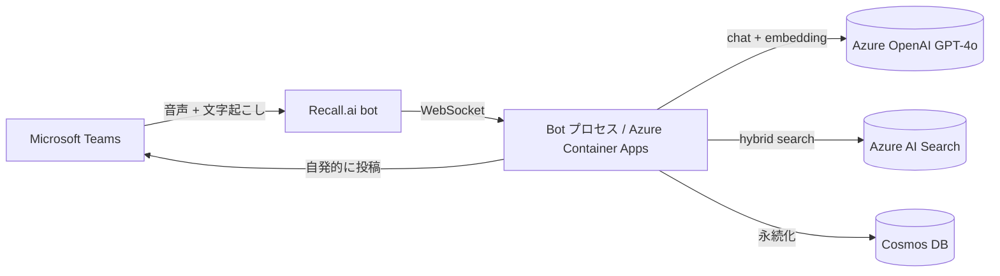

## はじめに

Teams の会議でこんな経験はないでしょうか。

- 仕様確認のために誰かが画面共有でドキュメントを探し始めて、会議の流れが止まる
- 「〇〇って何でしたっけ？」と用語の意味を聞かれて答えに詰まる

会議後の要約・アクション抽出は Microsoft 365 Copilot Recap で十分まかなえます。ただ Copilot は **会議が終わってから動く** 設計のため、会議中の用語不明や仕様確認の場面では助けてくれません。

そこを埋める「会議の場で動く相棒」を目指して、Bot エージェント **MOCHI-kiki** を作りました。きっかけは [Microsoft Agent Hackathon 2026](https://zenn.dev/hackathons/microsoft-agent-hackathon-2026) への参加で、技術選定の一部は「Azure + Microsoft AI」の枠に合わせています。

MVP は 2 機能で構成しています。1 つは **仕様補完**で、仕様確認発言を検知して社内ドキュメントを引き、200 字の回答を会議チャットへボット側から自発的に投稿します (Bot Framework でいう proactive メッセージ)。もう 1 つは **ライブ議事録ビュー**で、会議の発話から議事録とタイムラインをライブ生成し、管理コンソールで閲覧できます (会議チャットには投稿しません)。

仕様補完は「即答」を狙いましたが、後段で詳述するとおり Recall.ai 側の文字起こし遅延が大きく、**会議の流れに後追いで補足を入れる準同期の動き**に落ち着きました。

<!-- TODO: 公開前に YouTube 動画 URL を `@[youtube](VIDEO_ID)` 形式で挿入 -->
<!-- VIDEO_PLACEHOLDER -->


## アーキテクチャ全体像

システム構成は次のとおりです。



Recall.ai bot は別途 API で会議に投入する形で、図には書いていません。

Bot プロセスの中身は Semantic Kernel で組んでおり、仕様補完パイプラインの実装は後の章で詳しく見ていきます。

## Teams 音声取得は Recall.ai に委ねる

Teams 音声の自前取得には、Microsoft Graph まわりの大きな壁があります。

- **Communications API (Media Bot)** は ASP.NET Core ベースの C# 専用 SDK で、Linux コンテナで素直に動かしづらい
- 会議に media bot として参加するには Teams テナント管理者の同意 (RSC など) と AAD アプリ側のリソース許可が必要
- TLS 証明書付きの公開エンドポイントが必須

少人数チームが Python で 2 週間で踏破するには、どれもコストが大きすぎました。

そこで第三者 SaaS の **Recall.ai** を採用しました。Teams / Zoom / Google Meet 等の会議に bot として入り、音声と文字起こしを Webhook または WebSocket で渡してくれるサービスです。

**当初は低遅延を狙って WebSocket 経由を選びました**が、結果的にこの「低遅延を狙った」前提が後で崩れます (詳細は致命欠点章)。

第三者経由を選んだ代償は他にもあります。**会議音声と文字起こしが一度 Recall.ai のサーバを通る**点です。

本作品はハッカソン用のデモ環境としてこの構成を許容しましたが、社内本番に出すならデータ保管ポリシーやデータリージョンの確認が必要です。ボットのセッション単位の従量課金も発生します。

Python クライアント側で Teams URL のホワイトリスト検証・リトライ・シークレットの取り扱いを吸収しています。SDK レベルの呼び出し手順は Recall.ai の公式ドキュメントが詳しいため割愛します。

## 仕様補完パイプラインの実装

「仕様確認が必要そうな発言を検知 → 社内ドキュメントを引いて → 会議チャットに投稿」というフローを、Semantic Kernel のプラグインと通常クラスに分解しました。

処理の流れは次のとおりです。

1. **IntentAnalysis プラグイン** が発話を分類する (実質「spec_inquiry か、そうでないか」の判定)
2. `spec_inquiry` なら、抽出した `keywords` を **RAGSearch サービス** に渡す
3. RAGSearch が Azure AI Search のハイブリッド検索 (ベクトル + キーワード) で上位 3 件を取得
4. **AnswerGeneration プラグイン** が 3 件をコンテキストにして 200 字以内に整形
5. **ChatPoster サービス** が会議チャットへ自発的に投稿

オーケストレーターは `Orchestrator.process()` です。途中で「検索ヒット 0 件」「会議が登録されていない」のケースは早期リターンで投稿せず、`[仕様補完]` プレフィックスは Python 側で付与しています。

RAG 検索本体は Azure AI Search SDK の定型呼び出しなので本記事では割愛します。設定で押さえているのは次の 3 点です。

- Embedding は `text-embedding-3-small` (1536 次元)
- 日本語アナライザは `ja.lucene` を指定
- ベクトル検索アルゴリズムは HNSW (Hierarchical Navigable Small World) で、キーワード検索とのハイブリッド構成

IntentAnalysis と AnswerGeneration のプロンプト設計は、後段の「プロンプトの工夫」章で詳しく見ます。

## ライブ議事録ビュー — 会議チャットを汚さずに残す

仕様補完だけだと、議論の流れや決定事項は会議が終わった瞬間に追えなくなります。そこで発話から議事録とタイムラインをライブ生成し、別ウィンドウの管理コンソール (`/meeting?id=...`) で閲覧できる仕組みを追加しました。

会議チャットには投稿しないため、会議の場を汚さず議論の俯瞰ができる、という設計です。

ビューは 3 つ用意しています。

| ビュー | 中身 | 更新間隔 |
|--------|------|---------|
| 議事録 | GPT-4o で「議題 / 決定事項 / TODO / 質疑応答」の構造化 Markdown を全文再生成 | 90 秒 |
| タイムライン | 5 分ブロックごとに 150 字以内の要約。末尾ブロックのみ再要約し、確定済みブロックには触らない | 90 秒 |
| 文字起こし | 発話データをそのまま表示 | 5 秒ポーリング |

### 会議チャットへ投稿しない理由

仕様補完が「会議で全員に見せる前提」だったのに対し、議事録は「あとから振り返る前提」と用途が違うため別 UI に分けました。ボットの自発投稿で議論を汚さない動線分離です。後段の致命欠点 1 (レイテンシ) とも噛み合う設計で、即時性を諦めて非同期に振った形でもあります。

### 議事録ビューは全文再生成

増分更新の整合性管理は重く、90 秒間隔なら GPT-4o 1 回 (数秒) のコストで割り切れます。差分マージのバグを引き当てるより、シンプルに毎回作り直すほうが事故を起こしにくいと判断しました。

### タイムラインは末尾ブロックだけ再要約

5 分ブロックの過去分には触らないことで、再生成の発散を防ぎつつコストを定数オーダーに保ちます。確定済みは触らないという制約は、再現性と「過去分が会議中に書き換わらない」読者体験の両方に効いています。

なお文字起こしビューだけ更新間隔を 5 秒と短くしているのは、「最新の発話を即見たい」用途と「整理された情報を眺める」用途が違うためです。1 つのコンソール内で 2 種類のテンポを同居させています。

## プロンプトの工夫

GPT-4o に投げているプロンプトは 2 本です。会議中に動くエージェントは「短く・形式が予測可能で・ぶれない」ことが命なので、出力の暴れ方を抑える小細工を入れています。通底する方針は次の 3 つです。

- 出力形式は JSON か固定テンプレートに寄せる (後段の Python が解析・加工しやすい)
- 字数制約はプロンプトと Python 側の二重ガードで効かせる (LLM は字数指示を絶対には守らない)
- 見栄えの装飾 (プレフィックス等) は Python 側で付ける (LLM の自由度を上げない)

### IntentAnalysis: ルーティング判断を JSON で返させる

発話を分類して後段の RAG を起動するかを決めるための、軽量な意図検知プラグインです。`spec_inquiry` / `ambiguous` / `normal` の 3 値ラベルを返しますが、MVP で実アクションに繋ぐのは `spec_inquiry` のみ。`ambiguous` ラベルは将来実装 (まとめ章参照) のための足場として残してあります。

JSON 出力を強制し、後段の RAG 入力に使う `keywords` 配列も同じレスポンスで抽出させています。1 LLM 呼出で「分類 + 検索キーワード抽出」を済ませることでレイテンシを節約しています。

```python
# src/plugins/intent_analysis.py より抜粋 (各意図の例文行は割愛)
INTENT_PROMPT = """
あなたは会議の発話を分析する AI です。
以下の発話を分析し、JSON 形式で意図を返してください。

発話: {{$utterance}}

意図の分類:
- spec_inquiry: 仕様確認、用語の意味確認、ドキュメント参照が必要な発言
- ambiguous: 主語や目的語が不明確で解釈が複数できる発言
- normal: 上記以外の通常会話

JSON のみを返す（説明不要）:
{
  "intent": "spec_inquiry" | "ambiguous" | "normal",
  "confidence": 0.0-1.0,
  "keywords": ["キーワード1", "キーワード2"]
}
"""
```

### AnswerGeneration: 200 字制約とプレフィックスの分離

回答を 200 字以内に押さえるためのプラグインです。プロンプト側で 200 字を明示しつつ、Python 側でも `text[:200]` で二重に切る防御線を引いています。LLM は字数指示を絶対には守らないので、ガードは 2 層に分ける必要があります。

もう 1 つの工夫は **目印プレフィックスを LLM に書かせない** ことです。`[仕様補完]` のようなプレフィックスを LLM に任せると `[仕様補完] [補足] ...` のように崩れる事故が起きるため、プレフィックスは Python 側で付けます。

```python
# src/plugins/answer_generation.py 抜粋
ANSWER_PROMPT = """
あなたは会議中に仕様情報を提供する AI アシスタントです。
以下の会議での発言と、社内ドキュメントから取得した関連情報をもとに、
200 文字以内で簡潔に回答してください。

発言: {{$utterance}}

関連ドキュメント:
{{$context}}

回答は **[仕様補完]** というプレフィックスをつけずに、事実のみを簡潔に述べてください。
200 文字を超えた場合は最も重要な情報のみを残して切り詰めてください。
"""
```

会議という「秒単位で出力が参加者の目に晒される」場では、プロンプト側に遊びを残すと UX 事故になりやすいので、自由を奪う方向に倒しています。

## 現状の致命的な欠点 — 仕様補完投稿までのレイテンシが大きい

仕様補完の投稿が**会議中の会話に間に合わない**のが、MVP の最大の弱点です。

定量的な計測 (p50 / p95) は今後の課題ですが、構造的に積み上がる遅延の内訳は次の見込みです。

| 段 | 内訳 | 見込み時間 |
|----|------|----------|
| STT | Recall.ai 精度モード (発話塊の区切りまで貯めて返す) | 十数秒〜数十秒 |
| LLM 1 | IntentAnalysis (GPT-4o) | 1〜3 秒 |
| RAG | Azure AI Search ハイブリッド検索 | 1 秒以内 |
| LLM 2 | AnswerGeneration (GPT-4o) | 1〜3 秒 |
| 投稿 | Bot Framework の自発投稿 (proactive メッセージ) | 1 秒以内 |

主な原因は STT 段です。Recall.ai の `recallai_streaming` プロバイダのうち低レイテンシモード (`prioritize_low_latency`) は **英語専用**。日本語は `prioritize_accuracy` モード固定です。

```text
language_code other than english is not supported in low latency mode
```

精度モードは「会議の発話塊が一区切りつくまで貯めてから STT 結果を返す」挙動なので、STT だけで十数秒〜数十秒の遅延が乗ります。発話から投稿まで「会議の流れに **後追いで補足** を入れる」体感になります。

これを縮めるには、Recall.ai を諦めて別経路の STT に置き換える必要があります。例えば Azure AI Speech の低遅延 STT を自前 WebSocket で受ける、Deepgram のような低遅延 STT に切り替える、などです。

「Recall.ai だけで現実的に Teams 音声が取れる」ことと「議論を止めずに即答できる」ことは両立しない、というのが MVP で得た一番大きな学びです。

## まとめ

「会議の場で動く相棒」を目指して 2 週間で MVP を組み上げました。何ができて何ができていないかが、ようやく見えた状態です。

仕様補完の動線はつながり、Recall.ai + Semantic Kernel + AI Search で Teams へ自発的に投稿を返すところまで動きます。

一方で、仕様補完投稿の遅延は本番投入前に必ず潰す必要があります。詳細は「現状の致命的な欠点」章を参照してください。

### 次に追加したい機能

1 つめは **曖昧発言の対話的明確化**です。「あれをやっておいて」のような発言を検知し、発言者に DM で問い返したうえで整理文を会議に戻すフロー。`AmbiguityDetector` / `ClarificationSession` / `ClarificationSummary` までは実装済みで、テスト環境では動作確認済みです。残作業は本番の Bot Framework ライフサイクル接続のみ。

2 つめは **認識齟齬の検知**です。同じ単語を発言者間で違う意味に使っているケースの検出。現状は要件定義のみで実装は未着手で、これからプラグインの設計から着手します。

### 別記事で扱いたい論点

本記事ではスコープ外にした、運用面の話題です。

- Bot Framework と Teams Manifest の登録手順 (Entra ID アプリ登録、Manifest 配布)
- Container Apps / Azure OpenAI / AI Search を合わせた月額の実コスト感

会議の場で動く Bot を作っている方とは、ぜひ知見を交換したいです。リポジトリは現状プライベートですが、整理が済み次第公開予定です。公開時に本記事末尾へ GitHub URL を追記します。

## 参考

- [Microsoft Agent Hackathon 2026 (powered by Tokyo Electron Device)](https://zenn.dev/hackathons/microsoft-agent-hackathon-2026) (アクセス 2026-06-01)
- [Semantic Kernel 公式 overview](https://learn.microsoft.com/semantic-kernel/overview/) (アクセス 2026-06-01)
- [Recall.ai Real-time WebSocket Endpoint](https://docs.recall.ai/docs/real-time-websocket-endpoint) (アクセス 2026-06-01)
- [Azure AI Search ハイブリッド検索](https://learn.microsoft.com/azure/search/hybrid-search-overview) (アクセス 2026-06-01)
- [Azure Cosmos DB autoscale provisioned throughput](https://learn.microsoft.com/azure/cosmos-db/provision-throughput-autoscale) (アクセス 2026-06-01)
- [Azure Container Apps overview](https://learn.microsoft.com/azure/container-apps/overview) (アクセス 2026-06-01)
